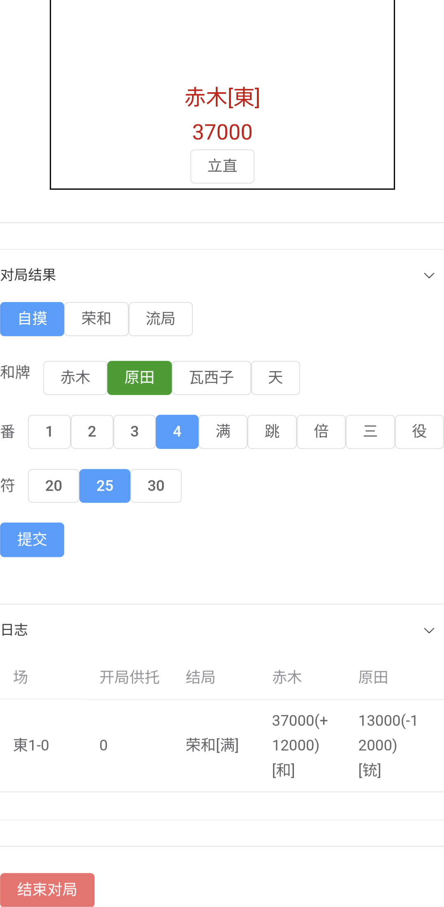

# riichi-counter

立直麻将计分器

* 应用网址 http://eplistical.github.io/RiichiC
* 用于面麻无点棒记分，立直时点击立直按钮，每手结束后输入番符等信息更新分数。

## 支持

### 游戏前
* 玩家名字
* 部分规则微调

### 游戏中
* 立直按钮
* 场况点棒显示

### 每手游戏后
* 输入番符自动计分
* 自动判断连庄和本场
* 游戏日志查询
* 如果结果输入错误可通过日志重置

### 游戏结束后
* 游戏日志查询
* 选手统计

## 页面展示

### 开局

### 对局

### 输入结果

### 统计

